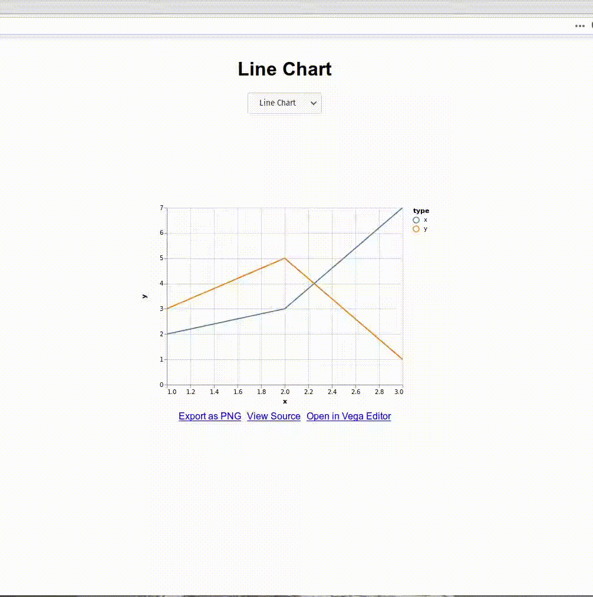

# Altair Dashboard
*A simple solution to create dashboards from altair charts*

## Usage
*Note:* Full example in examples/example_chart.py
```python
# ...

# Create your data
df = pd.DataFrame([
    [1,2,"x"],
    [2,3,"x"],
    [3,7,"x"],
    [1,3,"y"],
    [2,5,"y"],
    [3,1,"y"],
], columns=["x","y","type"])

# Create two altair charts
c1 = alt.Chart(df).mark_line().encode(
    x="x",
    y="y",
    color="type"
).interactive()

c2 = alt.Chart(df).mark_bar().encode(
    x= "x:O",
    y= "sum(y)",
    color="type"
).interactive()

dashboard = AltairDashboard()

# Add them to the dashboard
dashboard.add_chart("Line Chart", c1)
dashboard.add_chart("Bar Chart", c2)
dashboard.add_chart("Both Charts", c1 | c2)

dashboard.listen(port=8080)

```

## Screencast


